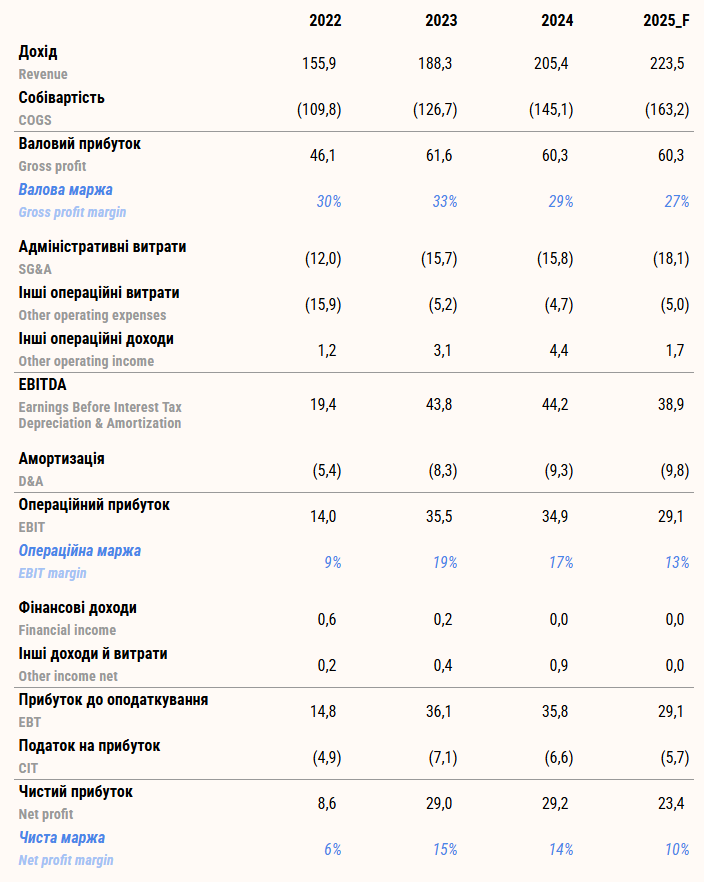
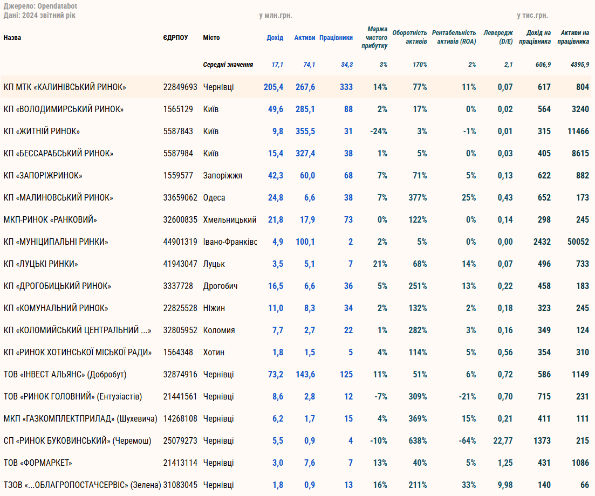
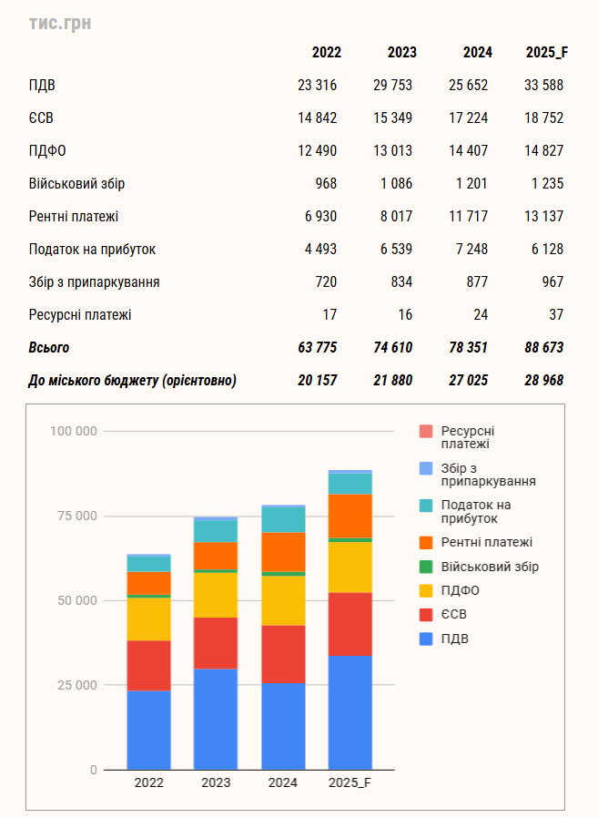

## Фінансовий аналіз КП МТК «Калинівський ринок»    

---   
### Короткий опис    

КП МТК «Калинівський ринок» (ЄДРПОУ 22849693) - один з найбільших в Україні ринків.    
Повна назва: Комунальне підприємство «Міський торговельний комплекс «Калинівський ринок»    
Народна назва: «Калинка»     

Основна мета ринку - організація гуртової й роздрібної торгівлі в м. Чернівці.    
На ринку можна знайти буквально таки будь-що 
(промтовари, одяг, килими, автомобілі, весільні сукні, продукти харчування, техніка і тд, і тп)    

---   
### Мій аналіз     

На базі даного підприємства я проходив переддипломну практику для магістерської роботи.    
Тут представлений готовий звіт - результат моєї аналітичної роботи ("Аналіз.pdf"),    
а також робочі файли ("Ексельки") та сорси даних ("Фін.звіти"), 
адже це комунальне підприємство і веде діяльність прозоро й відкрито.    

---   
### Деякі дані   

##### PnL

  

Фактично - це той самий Звіт про прибутки та збитки та Фінансовий план, просто перероблений подібно до міжнародного формату PnL, 
де ще пораховано й різні маржинальності. 

---   
##### Peer companies

  

 

На основі відкритих даних з ОпенДатаБоту (дохід, прибуток, активи, капітал, к-сть працівників) порівняв з іншими комунальними ринками України. 
Також цікаво було глянути на порівняння з ТК "Добробутом" (ТОВ  "ІНВЕСТ АЛЬЯНС"), адже хто був, той знає, що фактично це суміжні ринки.   

На жаль, до порівняння не вдалось додати одеський "7-ий кілометр" та хмельницьку "Товкучку", адже вони не мають однієї прозорої юр.особи. 

---   
##### Taxes

  

 

Для мене самого стало відкриттям, наскільки великим та потужним є ринок. 
Підприємство є найбільшим платником податків в Чернівецькій громаді. 
Працевлаштовано близько 350 осіб. 
